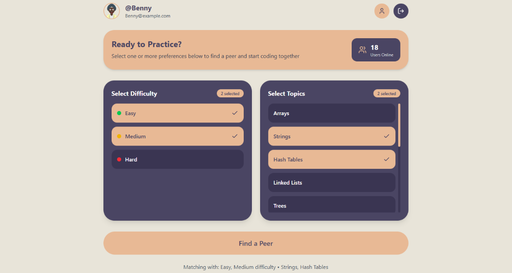
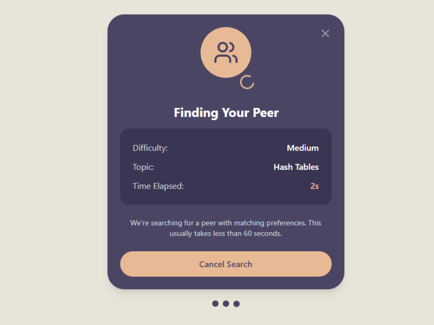
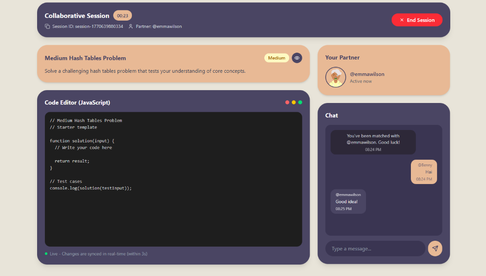

# Product Backlog (PeerPrep)

> Context: PeerPrep is a technical interview prep + peer matching platform with core services: User, Matching, Question, Collaboration, plus UI and local deployment.

## Legend
- Type: FR (Functional Requirement), NFR (Non-Functional Requirement), N2H (Nice-to-have)
- Priority: High / Medium / Low
- Milestone: D1(backlog), D2(user+question decisions), D3(matching+collab+containerization decisions), D4(final demo)

---

## 1. Must-have (M1–M5) epics

### Epic M1 — User Service
- [x] **F1** User can register and login.  
  Status: Completed | Priority: High | Milestone: D2
  - [x] **F1.1** Validate email/username/password during login. (Acceptance: invalid inputs rejected; errors shown)
    Status: Completed | Priority: High
  - [x] **F1.2** Store passwords securely (hash + salt via Firebase Auth).  
    Status: Completed | Priority: High
  - [x] **F1.3** Email verification before matching (via Firebase Auth Link).  
    Status: Completed | Priority: High

- [x] **F2** User can edit profile information.  
  Status: Completed | Priority: Medium | Milestone: D2
  - [x] **F2.1** Change password.  
    Status: Completed | Priority: Medium
  - [x] **F2.2** Change username (must remain unique).  
    Status: Completed | Priority: Medium
  - [x] **F2.3** Change avatar (via Avatar Picker).  
    Status: Completed | Priority: Medium

### Epic M2 — Matching Service
- [x] **F3** Match users based on selected criteria (topic + difficulty).  
  Status: Completed | Priority: High | Milestone: D3
  - [x] **F3.1** Create matching request and enqueue after topic/difficulty selection.  
    Status: Completed | Priority: High
  - [x] **F3.2** Pair exactly two users with same topic and difficulty.  
    Status: Completed | Priority: High
  - [x] **F3.3** Prevent self-match and multiple active requests per user.  
    Status: Completed | Priority: High
  - [ ] **F3.4** Show number of active users queuing (overall).  
    Status: Excluded | Priority: Medium (Team decision to not implement)

- [x] **F4** Manage matching state and wait times (notify/cancel/timeout).  
  Status: Completed | Priority: High | Milestone: D3
  - [x] **F4.1** Notify user when match found (polling status).  
    Status: Completed | Priority: Medium
  - [x] **F4.2** Allow user to cancel before match found.  
    Status: Completed | Priority: Medium
  - [x] **F4.3** Remove matched users from queue.  
    Status: Completed | Priority: High
  - [x] **F4.4** Redirect matched users to collaboration space with unique session ID.  
    Status: Completed | Priority: High

### Epic M3 — Question Service
- [x] **F5** Provide selectable topics and difficulty.  
  Status: Completed | Priority: High | Milestone: D2
  - [x] **F5.1** Provide topic list (Dynamic from Firestore).  
    Status: Completed | Priority: High
  - [x] **F5.2** Provide difficulty list (Easy/Medium/Hard).  
    Status: Completed | Priority: High

- [x] **F6** Provide question details for the session.  
  Status: Completed | Priority: High | Milestone: D2
  - [x] **F6.1** Show problem statement (Markdown support with KaTeX for math).  
    Status: Completed | Priority: High
  - [x] **F6.2** Provide starting coding template per question.  
    Status: Completed | Priority: Medium

### Epic M4 — Collaboration Service
- [x] **F7** Real-time collaborative code editor.  
  Status: Completed | Priority: High | Milestone: D3
  - [x] **F7.1** Real-time concurrent editing (Yjs + CodeMirror).  
    Status: Completed | Priority: High
  - [x] **F7.2** Syntax highlighting (Dracula theme, Python support).  
    Status: Completed | Priority: Medium

- [x] **F8** Communication between matched users (e.g., chat).  
  Status: Completed | Priority: Medium | Milestone: D3
  - [x] **F8.1** In-session chat with minimal delay (Socket.io).  
    Status: Completed | Priority: Medium

### Epic M5 — Basic UI
- [x] **F11** UI supports core flows (login, matching, collaboration, history, profile).  
  Status: Completed | Priority: High | Milestone: D4
  - [x] **F11.2** Registration/login screens with validation errors.  
    Status: Completed | Priority: High
  - [x] **F11.3** Matching screen (topic/difficulty selection, status).  
    Status: Completed | Priority: High
  - [x] **F11.4** Collaboration screen (code editor, chat, terminate session).  
    Status: Completed | Priority: High
  - [x] **F11.5** Dashboard for quick access to all services.
    Status: Completed | Priority: High

### Epic M6 — Local deployment
- [x] **DPL1** Run core services locally using containers (Docker Compose).  
  Status: Completed | Priority: High | Milestone: D3/D4

---

## 2. Non-functional requirements (NFR)

- [x] **N1** Username/email/password constraints and secure storage (Firebase Auth + RBAC).  
  Status: Completed | Priority: High
- [x] **N3** Matching timeout and user feedback (60-second timeout with fallback).  
  Status: Completed | Priority: High
- [x] **N9** Session security & isolation (Ticket-based auth for Socket.io sessions).  
  Status: Completed | Priority: High

---

## 3. Nice-to-haves (N2H)

- [x] **N2H-1** Question attempt history (Paginated history with full problem and code snapshots).
  Status: Completed | Priority: Medium
- [ ] **N2H-2** Display number of active users waiting in queue (Referenced in F3.4).
  Status: Excluded | Priority: Medium (Team decision to not implement)
- [x] **N2H-3** Enhanced communication tool - Chatbox within the collaboration session (Referenced in F8).
  Status: Completed | Priority: Medium
- [x] **N2H-4** CI/CD pipeline (GitHub Actions for linting, building and testing).
  Status: Completed | Priority: Medium
- [x] **N2H-5** AI-Assisted Problem Solving (In-session `@gemini` chatbot for hints and code reviews).
  Status: Completed | Priority: Medium
- [x] **N2H-6** API Gateway (Nginx/FastAPI gateway for centralized routing and auth verification).
  Status: Completed | Priority: Medium
- [x] **N2H-7** Enhanced Code Editor (Yjs-powered concurrent editing with presence markers).
  Status: Completed | Priority: Medium

---

## UI Mock-up

> Note: Current UI deviates from initial mock-ups to follow a unified "Cyber-Purple" aesthetic.

---

## Change Log

- 2026-02-23: Initial product backlog drafted from D1 phase.
- 2026-04-11: Updated backlog to reflect completed implementation as of D4 phase. Marked F3.4 and N2H-2 as excluded. Added AI assistance, API Gateway, and Enhanced Editor to Nice-to-haves.
