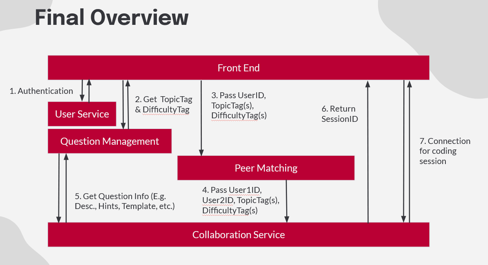
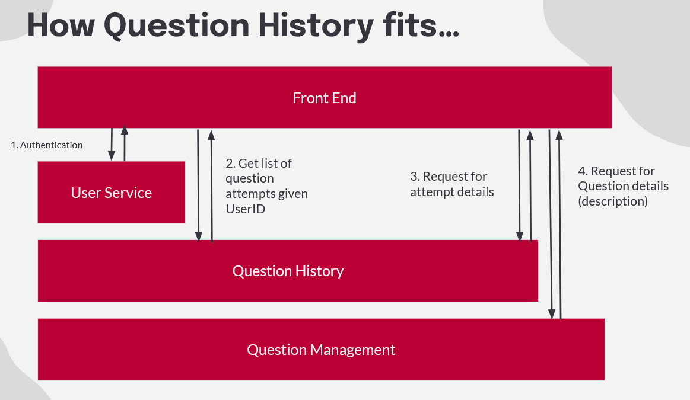

# UML Diagrams (UML.md)

This document is the **living UML documentation** for PeerPrep.  
**Note:** All diagrams and flows here are **subject to change** as requirements/design decisions evolve and as implementation details solidify; treat this as our current best snapshot unless updated before finalizing the project.

---

## 1. Scope & context

PeerPrep is designed around a microservices approach with core services (e.g., User, Matching, Question, Collaboration) and a Front End orchestrating user flows. 
This UML.md captures the architecture and interaction diagrams that support the required features (must-haves M1–M6) and implemented nice-to-haves (e.g., question attempt history, AI assistant).

---

## 2. Diagram index (quick links)

- [2.1 System overview](#21-system-overview)
- [2.2 Service-specific diagrams](#22-service-specific-diagrams)
- [2.3 Key user workflows](#23-key-user-workflows)

---

## 2.1 System overview

### 2.1.1 Component diagram (target)
**Goal:** A high-level component diagram showing Front End + each microservice boundary and major dependencies, created for early planning during D1 phase.

> The current diagram is **NOT** the C4 Component Diagram for the project, but a high-level system overview. We will look to replace this where appropriate during future updates.

---

## 2.2 Service-specific diagrams

### 2.2.1 API Gateway Sequence Diagram
Sequence diagram showing how the API Gateway centralizes Firebase Auth, handles token validation, performs Redis-based RBAC/deletion checks, and proxies requests to underlying microservices.

**Source:** [`plantUML/api-gateway-sequence.puml`](plantUML/api-gateway-sequence.puml)

### 2.2.2 User Service Sequence Diagram
Sequence diagram showing the user lifecycle: registration with Firebase Auth, email verification via SMTP, profile management (Firestore), and admin-led promotion/deletion flows.

**Source:** [`plantUML/user-service-sequence.puml`](plantUML/user-service-sequence.puml)

### 2.2.3 Question Service Sequence Diagram
Sequence diagram showing how questions are retrieved (randomly for matching or by ID for history) and how admins perform CRUD operations on the question bank stored in Firestore.

**Source:** [`plantUML/question-service-sequence.puml`](plantUML/question-service-sequence.puml)

---

## 2.3 Key user workflows

### 2.3.1 Regular user workflow (surface-level sequence)
This diagram shows the primary “happy path” from login → selecting topic/difficulty → matching → collaboration session start.

---

### 2.3.2 Collaboration flow — ticket acquisition and WebSocket connection

Sequence diagram showing how a user obtains a one-time ticket from the API Gateway (via Collab Service) and connects to the Collaboration Service via Socket.IO.

**Source:** [`plantUML/collab.puml`](plantUML/collab.puml)

Key points:
- Ticket validation is done in the collab service's Socket.IO middleware using Redis `GETDEL`.
- Each namespace connection (`/editor`, `/chat`) requires its own one-time ticket.
- Editor synchronization leverages Yjs binary updates persisted as base64 in Redis.

### 2.3.3 Match to collaboration — end-to-end flow

Sequence diagram showing the full flow from matching two users to establishing a collaborative coding session.

**Source:** [`plantUML/matchToCollab.puml`](plantUML/matchToCollab.puml)

Key points:
- Matching service uses **polling-based status checks** via Redis.
- Distributed session initialization is handled by the **API Gateway** using a Redis `SETNX` lock to elect a leader for room provisioning.
- The Gateway fetches the matching question and sets up shared metadata in Redis before users join.

### 2.3.4 Collaboration to History — session end & cleanup

Sequence diagram showing the session cleanup flow and how question attempt history is captured.

**Source:** [`plantUML/collabToHistory.puml`](plantUML/collabToHistory.puml)

Key points:
- 30-second grace period after a user disconnects before treating it as an "end session" event.
- **Collab Service handles history saving directly** by calling the History Service REST API with a snapshot of the code and session metadata.
- History is saved per user to ensure both participants have a record, even if one leaves early.
- Cleanup triggers 5 seconds after the last user is gone, clearing all Redis session-scoped keys.

---

## Change Log (Optional)

- 2026-02-23: Initial diagram drafted from D1 phase.
- 2026-03-20: Added collaboration flow diagrams (collab.puml, matchToCollab.puml, collabToHistory.puml).
- 2026-04-11: Updated `UML.md` to reflect the full contents of `docs/plantUML/`. Added descriptions for API Gateway, User Service, and Question Service diagrams. Noted corrections for polling-based matching and direct History Service integration by the Collaboration Service.
